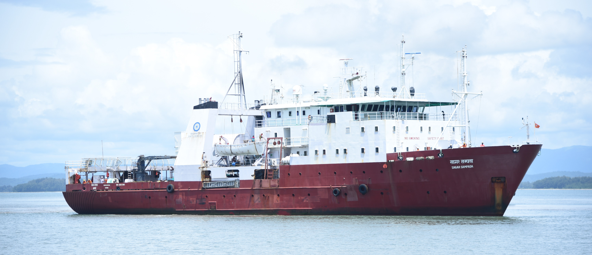
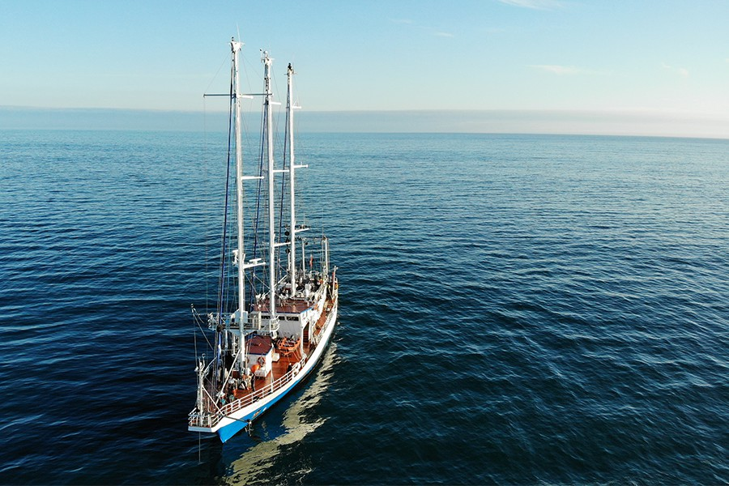

```{r setup, include=FALSE}
knitr::opts_chunk$set(echo = FALSE)
```

```{r fig.height=8}
# Load required libraries
library(ggplot2)
library(dplyr)
library(lubridate)
library(stringr)
library(ggrepel) # <-- Required for anti-overlapping

# 1. Dataset setup
timeline_data <- tibble::tribble(
  ~role, ~organization, ~start_str, ~end_str, ~details,
  "Project Assistant-II (PA-II)", 
  "National Institute of Oceanography (NIO), Kochi", 
  "2011-02-01", "2012-02-28", 
  "Phytoplankton ecophysiology, culturing and experimenting with PI curves",
  
  "Junior Research Fellow (JRF)", 
  "Centre for Marine Living Resource and Ecology (CMLRE), Kochi", 
  "2013-02-01", "2017-12-31", 
  "Observational oceanography for bio-regionalization of phytoplankton groups and dynamics of biogeochemistry",
  
  "Senior Research Fellow (SRF)", 
  "Cochin University of Science & Technology (CUSAT), Kochi", 
  "2018-01-01", "2023-01-31", 
  "Quantitative marine ecology using cruise data, Bio-Argo and remote sensing",
  
  "Research Associate (RA)", 
  "Nansen Environmental Research Centre (NERC), Kochi", 
  "2023-03-01", "2024-01-31", 
  "IPCC datasets and CMIP6 models on chlorophyll-a dynamics on MoEs funded EU HORIZON 2020 'COMFORT' Project",
  
  "Research Associate Consultant (RAC)", 
  "Rangson Aerospace Private Ltd", 
  "2024-03-01", "2025-06-30", 
  "Synthetic Aperture RADAR (SAR) on dual pol/quad pol datasets on various applications in surveillance systems"
) %>%
  mutate(
    start_date = as.Date(start_str),
    end_date = as.Date(end_str),
    mid_date = start_date + (end_date - start_date) / 2,
    period = paste0(format(start_date, "%b %Y"), " - ", format(end_date, "%b %Y")),
    wrapped_details = str_wrap(details, width = 45),
    label_text = paste0(role, "\n", organization, "\n(", period, ")\n", wrapped_details)
  )

# 2. Build non-overlapping timeline plot
ggplot(timeline_data) +
  # Main central vertical axis line
  geom_segment(
    aes(x = 0, xend = 0, y = as.Date("2010-06-01"), yend = as.Date("2026-06-01")),
    color = "#cccccc", linewidth = 1.2
  ) +
  # Duration segments for each position
  geom_segment(
    aes(x = 0, xend = 0, y = start_date, yend = end_date, color = role),
    linewidth = 3.5, lineend = "round"
  ) +
  # Node points for start and end dates
  geom_point(aes(x = 0, y = start_date, color = role), size = 3) +
  geom_point(aes(x = 0, y = end_date, color = role), size = 3) +
  # Center point where label segment connects
  geom_point(aes(x = 0, y = mid_date, color = role), size = 1.5) +
  # Repelled labels with built-in connector lines
  geom_label_repel(
    aes(x = 0, y = mid_date, label = label_text, color = role),
    direction = "y",              # Move labels along y-axis to prevent overlap
    nudge_x = 0.35,               # Shift all labels cleanly to the right
    hjust = 0, 
    vjust = 0.5, 
    size = 3.2, 
    fill = "#fcfcfc",
    label.padding = unit(0.4, "lines"),
    lineheight = 1.1,
    box.padding = unit(0.5, "lines"),
    point.padding = unit(0.3, "lines"),
    min.segment.length = 0,       # Always draw connecting line
    segment.color = "#888888",
    segment.linetype = "dashed",
    segment.size = 0.5
  ) +
  scale_y_date(
    date_breaks = "2 years",
    date_labels = "%Y",
    limits = c(as.Date("2010-06-01"), as.Date("2026-06-01"))
  ) +
  scale_x_continuous(limits = c(-0.2, 1.8)) +
  scale_color_brewer(palette = "Set1") +
  labs(
    title = "Career Timeline",
    subtitle = "Research & Professional Experience (2011 – 2025)",
    y = "Year",
    x = NULL
  ) +
  theme_minimal(base_family = "sans") +
  theme(
    plot.title = element_text(face = "bold", size = 16, hjust = 0),
    plot.subtitle = element_text(color = "gray30", size = 11, margin = margin(b = 15)),
    axis.text.x = element_blank(),
    axis.ticks.x = element_blank(),
    axis.title.x = element_blank(),
    axis.text.y = element_text(size = 10, face = "bold", color = "gray20"),
    panel.grid.major = element_blank(),
    panel.grid.minor = element_blank(),
    legend.position = "none",
    plot.margin = margin(20, 20, 20, 20)
  )
```

<aside>

### Research Vessels

#### FORV Sagarsampada

#### {width="400px"}

#### s/y OCEANIA {width="400px"}

</aside>

```{r fig.width=8}
library(ggplot2)
library(dplyr)
library(ggrepel)

# 1. Create the dataset
cruise_data <- data.frame(
  Year = c(2013, 2013, 2014, 2015, 2015, 2016, 2016, 2017, 2025, 2025, 2025),
  Cruise = c("Cruise 313", "Cruise 314", "Cruise 329", "Cruise 335", 
             "Cruise 339", "Cruise 341 (Leg 1)", "Cruise 341 (Leg 2)", 
             "Cruise 360", "Baltic Cruise 1", "Baltic Cruise 2", "Baltic Cruise 3"),
  Region = c(rep("Northern Arabian Sea", 8), rep("Southern Baltic Sea", 3))
)

# 2. Assign vertical position and proper horizontal offsets
cruise_data <- cruise_data %>%
  mutate(
    Y_Pos = if_else(Region == "Northern Arabian Sea", 1, 2),
    Year_Offset = case_when(
      Cruise == "Cruise 313" ~ 2012.85,
      Cruise == "Cruise 314" ~ 2013.15,
      Cruise == "Cruise 335" ~ 2014.85,
      Cruise == "Cruise 339" ~ 2015.15,
      Cruise == "Cruise 341 (Leg 1)" ~ 2015.85,
      Cruise == "Cruise 341 (Leg 2)" ~ 2016.15,
      Cruise == "Baltic Cruise 1" ~ 2024.7, 
      Cruise == "Baltic Cruise 2" ~ 2025.0,
      Cruise == "Baltic Cruise 3" ~ 2025.3,
      TRUE ~ as.numeric(Year)
    )
  )

# 3. Generate the ggplot2 visualization
ggplot(cruise_data, aes(x = Year_Offset, y = Y_Pos, color = Region)) +
  # Baseline tracks for each region
  geom_segment(data = data.frame(Y = c(1, 2), Xmin = c(2012.5, 2024.3), Xmax = c(2017.5, 25.7)),
               aes(x = Xmin, xend = Xmax, y = Y, yend = Y), 
               inherit.aes = FALSE, color = "grey70", linewidth = 1) +
  # Points for cruises
  geom_point(size = 4, alpha = 0.9) +
  # Non-overlapping labels
  geom_text_repel(aes(label = Cruise), 
                  size = 3.5, 
                  fontface = "bold",
                  box.padding = 0.5,
                  point.padding = 0.5,
                  force = 2,
                  max.overlaps = Inf,
                  show.legend = FALSE) +
  # Custom scales and theme
  scale_y_continuous(
    breaks = c(1, 2),
    labels = c("Northern Arabian Sea\n(2013–2017)", "Southern Baltic Sea\n(2025)"),
    limits = c(0.5, 2.5)
  ) +
  scale_x_continuous(
    breaks = c(2013, 2014, 2015, 2016, 2017, 2025),
    limits = c(2012, 2026.5)
  ) +
  scale_color_manual(values = c("Northern Arabian Sea" = "#1f77b4", "Southern Baltic Sea" = "#2ca02c")) +
  labs(
    title = "Research Expedition Timeline",
    subtitle = "156 Total Sea Days across Northern Arabian Sea and Southern Baltic Sea",
    x = "Year",
    y = NULL,
    color = "Region"
  ) +
  theme_minimal(base_size = 12) +
  theme(
    panel.grid.major.y = element_blank(),
    panel.grid.minor = element_blank(),
    panel.grid.major.x = element_line(linetype = "dashed", color = "grey80"),
    axis.text.y = element_text(face = "bold", size = 11),
    plot.title = element_text(face = "bold", size = 14),
    plot.subtitle = element_text(color = "grey30", size = 10),
    legend.position = "bottom"
  )
```

<aside>

#### INSTRUMENTATION

#### CTD \# Autoanalyzer \# HPLC \# Fluorometry \# C-14 Scintillation \# Counter \# Autosal \# ADCP \# Radiometry \# Echosounder #Settling Chamber #Epifluorescence Microscopy

</aside>
